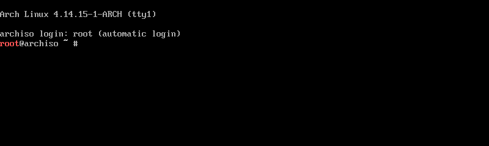
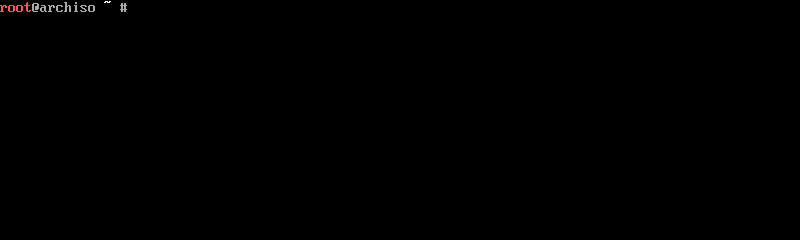

## 安装 archLinux 

### 安装前准备

```shell
# 下载  iso 镜像
# 1、插入U盘，df -h 查看U盘文件系统挂载情况，然后使用 umount /dev/sdb* 卸载U盘文件系统；

# 2、执行命令：sudo mkfs.xxx  /dev/sdb 格式化U盘为 xxx 格式；
# 请将xxx换成您需要的文件系统类型，如fat、vfat、ntfs、ext4等等

# 3、dd if=*/*.iso   of=/dev/sdb  bs=4M  (数据块大小，每个数据块只能存一个文件的数据)

# 4、执行sync，同步缓存中的数据至U盘
sudo dd bs=4M  if=archlinux.iso of=/dev/sdx status=progress  && sync
```

#### 启动安装环境

成功从准备好的安装介质中启动后，屏幕将呈现出一个菜单。请使用 [↑]/[↓]（方向键）进行选择，[↩] （回车键）确认。
BIOS：


UEFI：


当屏幕上出现命令行提示符及闪烁的光标时即启动完毕。



####  设置键盘布局

默认键盘布局为 US（美式键盘）。如需修改键盘布局请使用 *loadkeys* 命令。如需修改字体请使用 *setfont* 命令。

#### 网络连接

ArchISO 在启动时会尝试连接网络，可通过命令 *ping* 查看连接是否已建立。

```shell
ping -c 4 www.baidu.com
```


若网络尚未连接，请先接入网络。若使用 WiFi 连接，请使用 *wifi-menu* 命令。
若使用 ADSL 宽带连接，请使用 *pppoe-setup* 进行配置，再使用 *systemctl start adsl* 进行连接。

#### 刷新本地时间

```shell
# timedatectl set-ntp true
```

#### 配置软件仓库镜像

软件仓库镜像是软件仓库的拷贝副本。Arch Linux 在许多国家和地区都有仓库镜像，但是默认开启了所有仓库镜像，因而用户可能无法充分利用当地网络优势。为了达到最高的下载速度，需调整镜像顺序，提高当地镜像的优先级。
Arch Linux 的仓库镜像地址存于 */etc/pacman.d/mirrorlist*，每行一条按使用顺序排序。要让 Arch Linux 的包管理器 *pacman* 优先使用指定的仓库镜像，只需调整顺序，使之置于前列即可。

```shell
# nano /etc/pacman.d/mirrorlist
```

1. [F6] 搜索 china
2. [方向键] 移动光标至 Server 行
3. [CTRL+K] 剪切该行
4. [方向键] 移动光标至其他 Server 行前
5. [CTRL+U] 粘贴至此行
6. [CTRL+O] 保存，[回车键] 确定


```shell
# 中国大陆用户可使用以下命令选取大陆镜像服务器。
# sed -i '/China/!{n;/Server/s/^/#/};t;n' /etc/pacman.d/mirrorlist
```

### 环境检查

#### 启动模式检查

```shell
# ls /sys/firmware/efi/efivars
```

若该目录不存在，则当前是以 BIOS/CSM 模式启动，否则是以 UEFI 模式启动。


### 分区

#### 分区方案

- Arch Linux 要求至少一个分区分配给根目录 /。
- 在 UEFI 系统上，需要一个 UEFI 系统分区。

#### 实施分区

首先使用 *lsblk* 或 *fdisk -l* 确定目标磁盘及目标分区。

```shell
# fdisk -l
```


然后使用分区工具如 *parted*、*cfdisk* 进行分区。推荐 *cfdisk*

```shell
# cfdisk /dev/sdX    # sdX 为目标磁盘
```

```shell
新建分区：

1. [↑]/[↓]（方向键）选中 Free space（空闲空间）

2. [←]/[→]（方向键）选中 New 新建分区

3. [←]/[→]（方向键）选中 Type 选择分区类型（默认为 Linux filesystem；对于 EFI 系统分区选择 EFI System）

4. 输入分区大小（默认单位为字节，可以加上后缀K、M、G），[回车键] 确认

写入分区表：

1. [←]/[→]（方向键）选中 Write

2. 输入 yes [回车] 确定写入
```


#### 分区格式化（创建文件系统）

首先使用 *lsblk* 或 *fdisk -l* 确定目标磁盘及目标分区。

```shell
# lsblk
```

然后使用格式化工具进行格式化。本文推荐 EXT4 文件系统，其格式化工具为 *mkfs.ext4*。

```shell
# mkfs.ext4 /dev/sdXY    # sdXY 为目标分区
```


#### 挂载分区

`请注意挂载次序。从根目录开始，先挂载父目录，再挂载子目录`

```shell
# mount <分区> <挂载点>
```



#### 安装基础包

```shell
# pacstrap /mnt base
```


### 配置基础系统


## Pacman 命令详解

```shell
## Pacman 命令详解
    
# Pacman 是一个命令行工具，这意味着当你执行下面的命令时，必须在终端或控制台中进行。

# 1、更新系统

    # 在 Arch Linux 中，使用一条命令即可对整个系统进行更新：

        pacman -Syu

    # 如果你已经使用 pacman -Sy 将本地的包数据库与远程的仓库进行了同步，也可以只执行：

        pacman -Su

# 2、安装包

    pacman -S  # 包名 例如，执行 pacman -S firefox 将安装 Firefox。你也可以同时安装多个包，只需以空格分隔包名即可。
    pacman -Sy # 包名 与上面命令不同的是，该命令将在同步包数据库后再执行安装。
    pacman -Sv # 包名 在显示一些操作信息后执行安装。
    pacman -U  # 安装本地包，其扩展名为 pkg.tar.gz
    pacman -U http://www.example.com/repo/example.pkg.tar.xz # 安装一个远程包（不在 pacman 配置的源里面）

# 3、删除包

    pacman -R  <packname> # 该命令将只删除包，不包含该包的依赖。
    pacman -Rs <packname> # 在删除包的同时，也将删除其依赖。
    pacman -Rd <packname> # 在删除包时不检查依赖。
    pacman -Rsc <packname> # 在删除包的同时，删除所有依赖这个软件包的程序
    
# 4、搜索包

    pacman -Ss # 关键字 这将搜索含关键字的包。
    pacman -Qs # 关键字 搜索已安装的包。
    pacman -Qi <packname> # 查看有关包的信息。
    pacman -Ql  <packname> # 列出该包的文件。

# 5、其他用法

    pacman -Sw  <packname>#  只下载包，不安装。
    pacman -Sc Pacman # 下载的包文件位于 /var/cache/pacman/pkg/ 目录。该命令将清理未安装的包文件。
    pacman -Scc # 清理所有的缓存文件。

# 关于 Pacman 更加详细的用法，可以阅读 Pacman 的手册页
```
