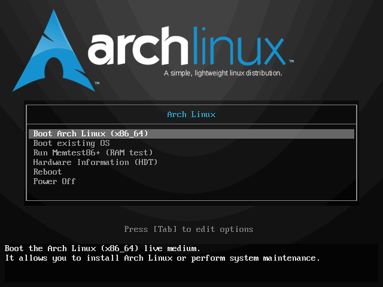

## 安装 archLinux 

### 安装前准备

```shell
# 下载  iso 镜像
# 1、插入U盘，df -h 查看U盘文件系统挂载情况，然后使用 umount /dev/sdb* 卸载U盘文件系统；

# 2、执行命令：sudo mkfs.xxx  /dev/sdb 格式化U盘为 xxx 格式；
# 请将xxx换成您需要的文件系统类型，如fat、vfat、ntfs、ext4等等

# 3、dd if=*/*.iso   of=/dev/sdb  bs=4M  (数据块大小，每个数据块只能存一个文件的数据)

# 4、执行sync，同步缓存中的数据至U盘
sudo dd bs=4M  if=archlinux.iso of=/dev/sdx status=progress  && sync
```

#### 启动安装环境

成功从准备好的安装介质中启动后，屏幕将呈现出一个菜单。请使用 [↑]/[↓]（方向键）进行选择，[↩] （回车键）确认。
BIOS：



UEFI：


当屏幕上出现命令行提示符及闪烁的光标时即启动完毕。


####  设置键盘布局

默认键盘布局为 US（美式键盘）。如需修改键盘布局请使用 *loadkeys* 命令。如需修改字体请使用 *setfont* 命令。

#### 网络连接

ArchISO 在启动时会尝试连接网络，可通过命令 *ping* 查看连接是否已建立。

```shell
ping -c 4 www.baidu.com
```


若网络尚未连接，请先接入网络。若使用 WiFi 连接，请使用 *wifi-menu* 命令。
若使用 ADSL 宽带连接，请使用 *pppoe-setup* 进行配置，再使用 *systemctl start adsl* 进行连接。

#### 刷新本地时间

```shell
# timedatectl set-ntp true
```

#### 配置软件仓库镜像

软件仓库镜像是软件仓库的拷贝副本。Arch Linux 在许多国家和地区都有仓库镜像，但是默认开启了所有仓库镜像，因而用户可能无法充分利用当地网络优势。为了达到最高的下载速度，需调整镜像顺序，提高当地镜像的优先级。
Arch Linux 的仓库镜像地址存于 */etc/pacman.d/mirrorlist*，每行一条按使用顺序排序。要让 Arch Linux 的包管理器 *pacman* 优先使用指定的仓库镜像，只需调整顺序，使之置于前列即可。

```shell
# nano /etc/pacman.d/mirrorlist
```

1. [F6] 搜索 china
2. [方向键] 移动光标至 Server 行
3. [CTRL+K] 剪切该行
4. [方向键] 移动光标至其他 Server 行前
5. [CTRL+U] 粘贴至此行
6. [CTRL+O] 保存，[回车键] 确定


```shell
# 中国大陆用户可使用以下命令选取大陆镜像服务器。
# sed -i '/China/!{n;/Server/s/^/#/};t;n' /etc/pacman.d/mirrorlist
```

### 环境检查

#### 启动模式检查

```shell
# ls /sys/firmware/efi/efivars
```

若该目录不存在，则当前是以 BIOS/CSM 模式启动，否则是以 UEFI 模式启动。


### 分区

#### 分区方案

- Arch Linux 要求至少一个分区分配给根目录 /。
- 在 UEFI 系统上，需要一个 UEFI 系统分区。

#### 实施分区

首先使用 *lsblk* 或 *fdisk -l* 确定目标磁盘及目标分区。

```shell
# fdisk -l
```


然后使用分区工具如 *parted*、*cfdisk* 进行分区。推荐 *cfdisk*

```shell
# cfdisk /dev/sdX    # sdX 为目标磁盘
```

```shell
新建分区：

1. [↑]/[↓]（方向键）选中 Free space（空闲空间）

2. [←]/[→]（方向键）选中 New 新建分区

3. [←]/[→]（方向键）选中 Type 选择分区类型（默认为 Linux filesystem；对于 EFI 系统分区选择 EFI System）

4. 输入分区大小（默认单位为字节，可以加上后缀K、M、G），[回车键] 确认

写入分区表：

1. [←]/[→]（方向键）选中 Write

2. 输入 yes [回车] 确定写入
```


#### 分区格式化（创建文件系统）

首先使用 *lsblk* 或 *fdisk -l* 确定目标磁盘及目标分区。

```shell
# lsblk
```

然后使用格式化工具进行格式化。本文推荐 EXT4 文件系统，其格式化工具为 *mkfs.ext4*。

```shell
# mkfs.ext4 /dev/sdXY    # sdXY 为目标分区
```


#### 挂载分区

`请注意挂载次序。从根目录开始，先挂载父目录，再挂载子目录`

```shell
# mount <分区> <挂载点>
```


#### 安装基础包

```shell
# pacstrap /mnt base
```


### 配置基础系统

#### 生成分区表

```shell
# genfstab -U /mnt >> /mnt/etc/fstab
```

接着使用 *arch-chroot* 进入新系统。

```shell
# arch-chroot /mnt
```

#### 时区

```shell
# ln -sf /usr/share/zoneinfo/$(tzselect) /etc/localtime
# 中国大陆用户使用以下命令。
# ln -sf /usr/share/zoneinfo/Asia/Shanghai /etc/localtime
```


#### 硬件时间设置

```shell
# hwclock --systohc
```

####  本地化设置

进行本地化设置以正确显示本地文字、货币、时间与时期格式以及其它本地相关标准。
编辑 /etc/locale.gen，去掉需要的 locale 的注释（行头的字符 #）。

```shell
# nano /etc/locale.gen
```

1. [F6] 搜索 zh_CN.UTF-8
2. [←]/[→]（方向键）移动光标至字符 # 处
3. [DELETE]/[BACKSPACE] 删除字符 #
4. [CTRL+O] 保存，[回车键] 确定

然后使用 *locale-gen* 生成 locale。

```shell
# locale-gen
```


接着使用以下命令设置默认 locale。

```shell
# echo LANG=<默认 locale>  > /etc/locale.conf
# echo 'LANG=zh_CN.UTF-8'  > /etc/locale.conf
```

####  主机名

```shell
# echo <主机名> > /etc/hostname
```

接着向 /etc/hosts 文件添加 hosts 条目。

```shell
#<ip-address>	<hostname.domain.org>	<hostname>
127.0.0.1	localhost.localdomain	localhost
::1		localhost.localdomain	localhost
127.0.1.1	<主机名>.localdomain	<主机名>
```

#### 网络连接

考虑到多数用户最终会安装图形化的桌面环境，因而推荐使用兼容性较好 NetworkManager 来管理网络。需要注意的是，当前安装环境已连接至网络，请勿尝试多次连接，而待安装完成并重启后再进行连接。

首先安装 NetworkManager：

```shell
# pacman -S networkmanager
```

* 如果需要图形化的管理工具，以便稍后在桌面环境中使用，可接着安装 *nm-connection-editor*
* 如果需要系统托盘工具，可接着安装 *network-manager-applet*
* 如果需要 ADSL 支持，需要安装 *rp-pppoe*

#### 为 root 用户设置密码

```shell
# passwd
```

#### 安装引导程序

引导程序是机器启动后运行的第一个程序，其作用在于加载并启动系统内核。本文推荐安装并介绍如何配置 GRUB 作为引导程序。如需安装其他引导程序

BIOS 系统：

```shell
# pacman -S grub os-prober
# grub-install --target=i386-pc /dev/sdX    # sdX 为目标磁盘
# grub-mkconfig -o /boot/grub/grub.cfg
```

UEFI 系统：

```shell
# pacman -S dosfstools grub efibootmgr
# grub-install --target=x86_64-efi --efi-directory=<EFI 分区挂载点> --bootloader-id=GRUB
# grub-mkconfig -o /boot/grub/grub.cfg
```

#### 完成安装

至此，基础可用的 Arch Linux 便安装完毕。现在按下列步骤退出安装环境并重启。
1. 使用命令 *exit* 或 [CTRL+D] 退回安装环境
2. 卸载新分区：

```shell
# umount -R /mnt
```

3. 重启

```shell
# reboot
```

4. 移除安装介质

### 用户管理

添加用户使用 *useradd* 命令。具体用法请查看 man 手册或 help 消息。

```shell
# useradd -m -g users -s /bin/bash archuser
```

该命令创建一个名为 archuser 的用户，指定登录 shell 为 bash，所属主用户组 users，并在 /home 下创建同名用户文件夹。

```shell
passwd archuser
```

该命令为用户 archuser 设置密码。

### 配置图形界面

####  安装显卡驱动

官方软件软件仓库为主流的显卡提供了驱动包：

\### 通用显卡驱动
*xf86-video-vesa* 是开源的显卡驱动实现，提供了最基本的显示功能。

\### 因特尔显卡驱动
因特尔显卡应当是开箱即用的，不需要安装显卡驱动，但通常建议安装 *mesa* 以支持 3D 加速。如果需要 Vulkan 支持（需 Ivy Bridge 及更新架构），须安装 *valkan-intel*。如果需要支持 Xorg 2D 加速，须安装 *xf86-video-intel*。
然而需要注意的是，安装 *xf86-video-intel* 与否需要更多斟酌，[详见此处](https://wiki.archlinux.org/index.php/Intel_graphics_(简体中文))。

\### 英伟达显卡驱动
英伟达显卡驱动有第三方的开源实现 *xf86-video-nouveau* 和英伟达官方私有驱动 *nvidia* 系列。

\* 对于 GeForce 600 及更新系列（除了 610, 620, 625, 705, 800A 和其他低端重贴牌显卡）请安装 *nvidia*
\* 对于 2010 至 2011 年间 GeForce 400/500 请安装 *nvidia-390xx*
\* 对于 2006 至 2010 年间 GeForce 8000/9000、ION 和 100-300 系列 [NV5x, NV8x, NV9x and NVAx] 请安装 *nvidia-340xx*
\* 更早的显卡系列驱动[请查阅此处](https://wiki.archlinux.org/index.php/NVIDIA#Unsupported_drivers)

> 如果需要 NVIDIA Optimus 支持，[请查阅此处](https://wiki.archlinux.org/index.php/NVIDIA_Optimus_(简体中文))。

\### AMD/ATI
AMD/ATI 显卡驱动原先有开源实现 *xf86-video-ati* 及闭源实现 AMD Catalyst。而AMD 自统一开源驱动和闭源驱动后又发布了新的开源实现 *xf86-video-amdgpu* 和闭源实现 AMDGPU PRO。其中 AMD Catalyst 及 AMDGPU PRO 不被 Arch Linux 官方所支持（未收录于官方软件仓库）。

\* *xf86-video-amdgpu* 支持 GCN 1、GCN 2、GCN 3、GCN 4 及更新架构的显卡。
\* AMDGPU PRO 支持 GCN 3、GCN 4 及更新架构的显卡。
\* *xf86-video-ati* 支持 X1000 及更早的显卡、TeraScale 1、TeraScale 2、TeraScale 3、GCN 1、GCN 2 架构的显卡。
\* AMD Catalyst 支持 TeraScale 2、TeraScale 3、GCN 1、GCN 2、GCN 3 架构的显卡。
\* AMD Catalyst Legacy 支持 TeraScale 1 架构的显卡。

###  中文字体

本文推荐思源黑体，可通过以下命令安装。

```shell
# pacman -S adobe-source-han-sans-cn-fonts
```

### 安装桌面环境

### 安装中文输入法

##### # 推荐阅读

- [Arch 用户软件仓库](https://wiki.archlinux.org/index.php/Arch_User_Repository_(简体中文))
- [AUR 助手工具](https://wiki.archlinux.org/index.php/AUR_helpers_(简体中文))


## Pacman 命令详解

```shell
## Pacman 命令详解
    
# Pacman 是一个命令行工具，这意味着当你执行下面的命令时，必须在终端或控制台中进行。

# 1、更新系统

    # 在 Arch Linux 中，使用一条命令即可对整个系统进行更新：

        pacman -Syu

    # 如果你已经使用 pacman -Sy 将本地的包数据库与远程的仓库进行了同步，也可以只执行：

        pacman -Su

# 2、安装包

    pacman -S  # 包名 例如，执行 pacman -S firefox 将安装 Firefox。你也可以同时安装多个包，只需以空格分隔包名即可。
    pacman -Sy # 包名 与上面命令不同的是，该命令将在同步包数据库后再执行安装。
    pacman -Sv # 包名 在显示一些操作信息后执行安装。
    pacman -U  # 安装本地包，其扩展名为 pkg.tar.gz
    pacman -U http://www.example.com/repo/example.pkg.tar.xz # 安装一个远程包（不在 pacman 配置的源里面）

# 3、删除包

    pacman -R  <packname> # 该命令将只删除包，不包含该包的依赖。
    pacman -Rs <packname> # 在删除包的同时，也将删除其依赖。
    pacman -Rd <packname> # 在删除包时不检查依赖。
    pacman -Rsc <packname> # 在删除包的同时，删除所有依赖这个软件包的程序
    
# 4、搜索包

    pacman -Ss # 关键字 这将搜索含关键字的包。
    pacman -Qs # 关键字 搜索已安装的包。
    pacman -Qi <packname> # 查看有关包的信息。
    pacman -Ql  <packname> # 列出该包的文件。

# 5、其他用法

    pacman -Sw  <packname>#  只下载包，不安装。
    pacman -Sc Pacman # 下载的包文件位于 /var/cache/pacman/pkg/ 目录。该命令将清理未安装的包文件。
    pacman -Scc # 清理所有的缓存文件。

# 关于 Pacman 更加详细的用法，可以阅读 Pacman 的手册页
```
